# Job Pack Assistant × ICB MES — Integration Investigation

| | |
|---|---|
| **Document type** | BA Investigation & Architecture Recommendation |
| **Author** | Senior Business Analyst / Solution Architect (Claude, on behalf of Michael) |
| **Date** | 5 July 2026 |
| **Status** | Draft v0.1 — pending Discovery inputs from Simeon (see §11 Open Questions Register) |
| **Audience** | Business users, BAs, and Claude Code Agents. Written in plain English. |
| **Related documents** | `SIMEON_DISCOVERY_QUESTIONNAIRE.md`, `SIMEON_PACKAGING_INSTRUCTIONS.md` (same folder) |

> **Naming convention used throughout:** Simeon's solution is called the **Job Pack Assistant**.
> The Manufacturing Execution System is called the **MES**.

---

## 1. Executive Summary

**Summary.** Simeon (Production Planner and SME) has built a valuable AI-assisted tool on his laptop using Claude Code. From observation, it assembles Job Packs (collating job documents, drawings, and supporting paperwork for a production job) and finds/organises manufacturing drawings. It exists only on his laptop, is not in Git, and is evolving weekly. The MES (v1.40.0, Phase 1 live) has no knowledge of it today.

**Recommendation.** A staged hybrid (Option 5, delivered via the "Graduation Model" in §6):

1. **Protect first** — get the Job Pack Assistant into its own private GitHub repository this week. This is urgent regardless of any integration decision.
2. **Understand second** — run Discovery on the real code and prompts (questionnaire + packaged copy).
3. **Connect through a contract, not a merger** — the MES and the Job Pack Assistant agree on a small, stable "contract": a shared document location, a naming standard keyed on job number, and (later) one or two simple read-only data feeds from the MES.
4. **Graduate stable features over time** — once a Job Pack function is repeatable and no longer changing, Code Agents turn it into a small service the MES can call with a button. Simeon keeps innovating upstream in Claude Code, unblocked.

**Reason.** This is the only approach that scores well on all seven of ICB's stated goals at once: it removes the laptop single-point-of-failure immediately, keeps Simeon as owner and SME without slowing him down, never couples the fast-moving experimental tool to MES release discipline, and gives Code Agents a clean, well-defined seam to build against.

**Next step.** Send Simeon the packaging instructions (§ companion document), create the `icb-jobpack` private repository, and get answers to the top 10 open questions in §11.

### The one-paragraph analogy

The Job Pack Assistant today is a **skilled craftsman with a well-organised toolbox**, not a vending machine. Simeon sits down, talks to Claude Code, and excellent Job Packs come out — but there is no button anyone else can press. "Integrating" it into the MES therefore does **not** mean bolting the toolbox onto the MES. It means: (a) making sure the toolbox can't be lost (Git), (b) agreeing which shelf the finished work goes on so the MES can always find it (shared document store + naming standard), and (c) over time, turning the most repeatable jobs into vending-machine buttons (small services) — while the craftsman keeps inventing new tools.

---

## 2. Phase 1 — Discovery

Discovery is **partially complete**. This section separates what we *know* (with evidence) from what we *assume* (flagged, low-confidence) and what we *must ask* (forwarded to §11 Open Questions Register). Per the investigation brief, nothing below is guessed silently — every assumption is labelled.

### 2.1 What we know (confirmed facts)

| # | Fact | Evidence |
|---|------|----------|
| F1 | The Job Pack Assistant **assembles Job Packs** — collates job documents, drawings and supporting paperwork into a complete pack for a production job | Directly observed by Michael |
| F2 | It **finds and organises manufacturing drawings** for a job | Directly observed by Michael |
| F3 | Simeon operates it **by typing into Claude Code** — there is no separate app or screen | Directly observed by Michael |
| F4 | The code/prompts exist **only on Simeon's laptop**; not in GitHub; actively evolving | Assignment brief |
| F5 | Simeon is the **business owner and primary SME** and intends to keep enhancing it | Assignment brief |
| F6 | The MES repo contains **no trace** of the Job Pack Assistant — no docs, handoffs, or code references | Repo-wide search, 5 Jul 2026 |
| F7 | The MES already provisions an **`ANTHROPIC_API_KEY`** and a **`FILE_STORE`** setting in its environment config | `backend/.env.example`, README §D4 |
| F8 | The MES is a FastAPI + React system on an on-prem server (`192.168.0.251`), PostgreSQL 16, with an established ADR governance practice | README §6, `docs/adr/` |
| F9 | Simeon is already an MES user (Materials/Planning/Stores role, `planner@icecoldgrp.co.za`) and receives all pre-job CC emails | README §2 |

**Why F3 matters most.** Because Simeon "types into Claude Code", the Job Pack Assistant is best understood as a **workflow**: a combination of instruction files (e.g. `CLAUDE.md`), possibly skills, helper scripts, prompts, and folder conventions — with Claude Code as the engine. There is very likely **no callable program** the MES could invoke today. This single fact rules out any "just call it via API" quick win and shapes every option in §4.

### 2.2 Business view (what problem it solves)

A **Job Pack** in a manufacturing business is the bundle of paperwork the shop floor needs to build one job: the job card, manufacturing drawings, bill of materials, specifications, and quality/inspection sheets. At ICB (refrigerated truck bodies) a pack plausibly includes chassis details, body drawings, insulation specs, fridge-unit documentation, the signed pre-job card, and QC checklists — **to be confirmed** (Q1–Q4).

| Question | Current answer | Confidence |
|---|---|---|
| What problem does it solve? | Manual, slow, error-prone assembly of Job Packs and hunting for the right drawing revisions | Assumed — confirm Q1 |
| Who uses it? | Simeon only (possibly outputs used by production floor) | Assumed — confirm Q2 |
| How often? | Unknown — plausibly per production job | Ask — Q3 |
| Which processes depend on it? | Likely the handoff from Planning → Production (after Pre-Job Confirmed) | Assumed — confirm Q4 |
| Business value | Time saved per pack; fewer wrong-drawing errors on the floor; captured SME knowledge | Quantify in Discovery — Q5 |

### 2.3 Functional view (what it does)

Confirmed: Job Pack assembly (F1) and drawing finding/organising (F2). **Not yet confirmed:** whether it also extracts data from drawings/PDFs, answers questions about documents, generates new documents (cover sheets, checklists), or handles revisions. → Q6–Q9.

### 2.4 Technical view (high level only — enough for business decisions)

| Item | Status |
|---|---|
| Programming language | Unknown — likely Python and/or shell scripts orchestrated by Claude Code. Ask Q10 |
| Framework | Likely none (Claude Code is the runtime) — confirm from packaged copy |
| Folder structure | Unknown — will be visible in packaged copy |
| Local storage / database | Unknown — likely plain folders; any database would be significant. Ask Q11 |
| External libraries | Unknown — visible in packaged copy |
| Claude prompts / instructions | Almost certainly the **core intellectual property** — `CLAUDE.md`, skills, prompt files. Ask Q12 |
| AI workflow | Interactive: Simeon converses with Claude Code per job. Confirm Q13 |
| Configuration / dependencies | Claude Code subscription on Simeon's laptop; local file access. Ask Q14 |

> **Key BA point:** in this solution, *the prompts are the business logic*. They encode Simeon's tribal knowledge about what a correct Job Pack contains. Versioning and protecting the prompts matters as much as protecting any code.

### 2.5 Document management view

All unknown — this is the highest-value Discovery area, because **documents are where the two systems will first meet**. Questions Q15–Q21 cover: where documents and drawings live today (laptop vs shared drive), file formats, naming standards, how drawing revisions are managed, relationships between files, and where finished packs are stored. The MES repo's `latest documents/` folder (loose Excel files: MRP, Truck Register, Inventory, Costing Module) suggests ICB documents currently live in scattered locations — reinforcing the need for one agreed document home.

### 2.6 Ownership and governance model (recommended)

| Asset | Owner | Notes |
|---|---|---|
| Business process (Job Pack content & correctness) | **Simeon** | He is SME; this must not change |
| Documents & drawings (masters) | **ICB** (business), managed per agreed standard | Today effectively Simeon's laptop — must move to a shared, backed-up location |
| AI prompts / skills / instructions | **Simeon** (author) in the `icb-jobpack` repo | Versioned in Git; Michael as repo admin for continuity |
| Source code (helper scripts) | **Simeon** (author), maintained with Code Agent help | Same repo |
| The integration contract (§6.2) | **Michael (BA lead)**, changes agreed by both sides | Small, documented, versioned |
| Graduated Job Pack services (future) | **MES team / Code Agents**, business rules still owned by Simeon | Simeon signs off behaviour; Code Agents own the code |
| Future enhancements | **Simeon** proposes and builds with Claude Code; anything crossing the contract needs Michael's agreement | Keeps Simeon fast *and* the MES safe |

**Governance principles (plain English):**

1. **Simeon's repo is his workshop.** He can change anything, any time, without asking — as long as the contract (shared document location, naming standard, data feed formats) is honoured.
2. **The contract is the only thing the MES depends on.** The MES never reads Simeon's prompts, never calls his scripts directly, never assumes his folder layout.
3. **Changes to the contract are rare and deliberate** — agreed between Simeon and Michael, written down, versioned (same discipline as the MES's existing ADR practice).
4. **A "bus factor" rule:** at least Michael (admin) has access to the repo, and packs must be reproducible from the repo + documented steps — not only from Simeon's memory.

---

## 3. Phase 2 — Current (As-Is) Workflow

> Based on observed facts F1–F3 plus stated context. Steps marked ⚠ are assumptions to verify with Simeon.

### 3.1 As-Is flowchart

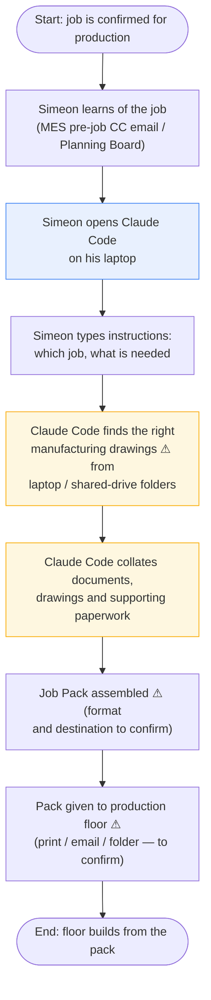

### 3.2 As-Is swim-lane view

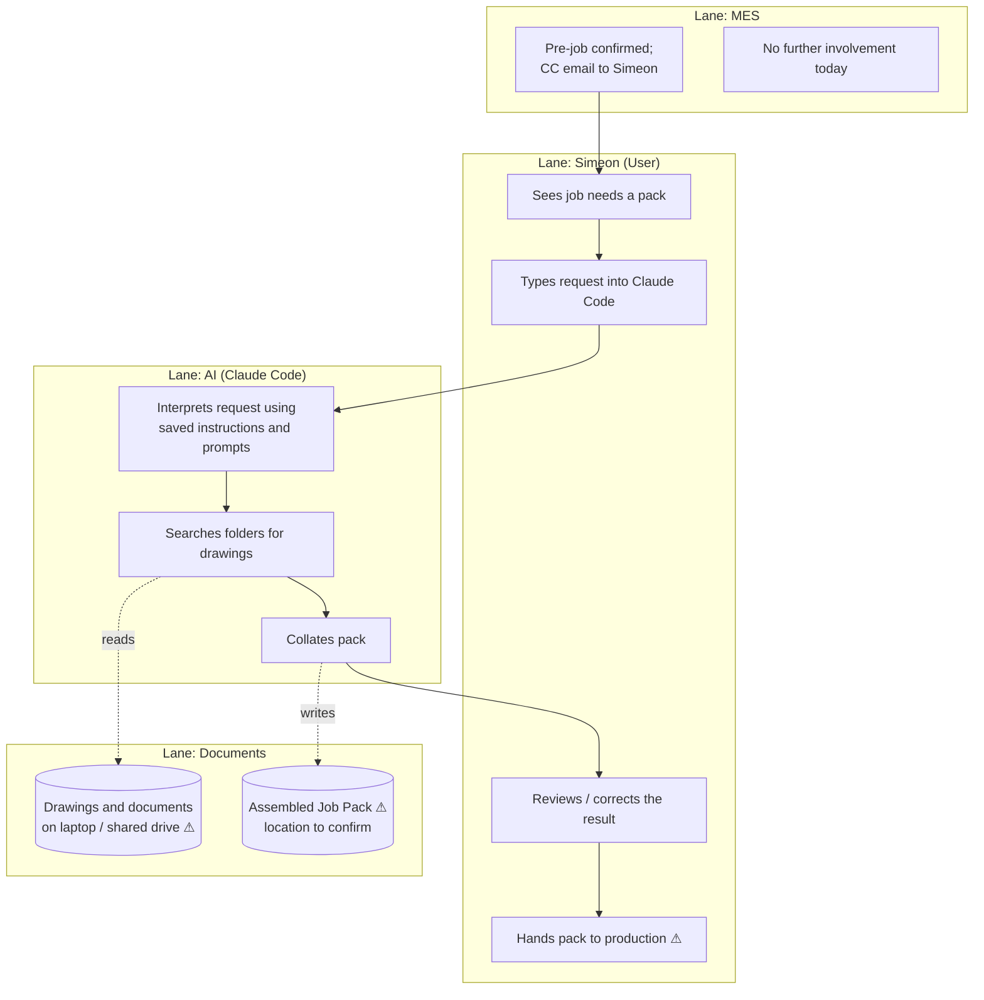

**What the swim-lanes reveal:** the MES's involvement **ends** at the CC email; the Job Pack world is invisible to it. There is no shared document location, no link from an MES job to its pack, and everything after "Pre-Job Confirmed" depends on one person and one laptop.

### 3.3 As-Is pain points (BA assessment)

| # | Pain point | Impact |
|---|---|---|
| P1 | Whole capability lives on one laptop — theft, failure, or Simeon's absence stops it | **Critical** |
| P2 | No version control — an accidental prompt edit can silently break pack quality, with no way back | High |
| P3 | MES and Job Pack are blind to each other — job data is likely retyped ⚠, and the MES cannot show "pack ready" status | High |
| P4 | Tribal knowledge is now encoded in prompts nobody else has read | High |
| P5 | No agreed naming/storage standard for drawings and packs → consistency risk as ICB scales | Medium |

---

## 4. Phase 3 — Integration Options

Six options were evaluated. Ratings use a simple scale: 🟢 good · 🟡 workable · 🔴 poor.

### Option 1 — Keep fully independent; MES just links to it

The Job Pack Assistant stays exactly as it is. The MES might show a note or a link ("Job Pack managed by Simeon").

| Aspect | Assessment |
|---|---|
| Advantages | Zero effort; zero disruption to Simeon; nothing to build |
| Disadvantages | Fixes none of the pain points P1–P5; laptop risk remains; no data sharing; MES stays blind |
| Cost | 🟢 None |
| Risk | 🔴 High — the status quo *is* the risk |
| Maintenance effort | 🟢 None |
| Scalability | 🔴 One person, one laptop |
| Ease of future development | 🟡 Simeon unblocked, but nobody else can build on it |
| Ease for Simeon | 🟢 Perfect — nothing changes |
| Ease for Code Agents | 🔴 Nothing for them to work with |

### Option 2 — MES calls the Job Pack Assistant through an API

The MES presses a button; the Job Pack Assistant does the work and returns a pack.

| Aspect | Assessment |
|---|---|
| Advantages | Best end-user experience; pack status visible in MES |
| Disadvantages | **Not possible today** — there is no API to call (fact F3). Claude Code is an interactive tool on a laptop, not a server. Would require converting the whole solution into a service first — a big-bang rebuild while it is still changing weekly |
| Cost | 🔴 High (a rebuild disguised as an integration) |
| Risk | 🔴 High — rebuilding a moving target; Simeon's iteration speed dies |
| Maintenance effort | 🔴 High |
| Scalability | 🟢 Good, once it exists |
| Ease of future development | 🔴 Every Simeon experiment now needs deployment discipline |
| Ease for Simeon | 🔴 Poor — he loses his conversational workflow |
| Ease for Code Agents | 🟡 Clear target, but built on unstable requirements |

> **Verdict:** right destination for *some* functions, wrong first move. This becomes the *end state* of the Graduation Model, not the starting point.

### Option 3 — Convert the whole solution into a shared service

Everything Simeon built becomes one service running on the MES server (own process, own API), used by anyone.

Same fundamental problem as Option 2 — a full conversion of an actively-evolving, prompt-driven workflow — plus one more: an AI-conversation workflow ("look at this odd job, use judgement") does not convert cleanly into a fixed service. The parts that *do* convert cleanly are the repeatable ones — which is exactly what the Graduation Model (Option 5/6) harvests gradually. Ratings: Cost 🔴, Risk 🔴, Simeon's ease 🔴.

### Option 4 — Embed all functionality directly into the MES

Job Pack code, prompts and screens move into the `icb-platform` repo and become MES features.

| Aspect | Assessment |
|---|---|
| Advantages | One system, one repo, one deploy; deepest possible integration |
| Disadvantages | Simeon stops being able to iterate independently — every prompt tweak becomes an MES release; couples ICB's most experimental work to its most disciplined codebase; contradicts the stated goal ("the goal is not simply to merge Simeon's work into the MES") |
| Cost | 🔴 Highest |
| Risk | 🔴 Highest — slows both systems |
| Maintenance effort | 🔴 High |
| Scalability | 🟢 Good on paper |
| Ease for Simeon | 🔴 Worst option for him |
| Ease for Code Agents | 🟡 Familiar repo, but constant churn from prompt changes |

### Option 5 — Hybrid: independent evolution + narrow agreed interfaces ⭐ Recommended

Simeon's solution keeps evolving independently in its own repo. The two systems meet only at a small, stable **contract**:

1. **A shared document store** — packs and drawings live in an agreed server location (the MES already has a `FILE_STORE` concept), not on a laptop.
2. **A naming standard** — everything keyed on the MES job number, so either system can find any job's documents.
3. **(Later) one or two data feeds** — the Job Pack Assistant reads job details from the MES's existing read-only APIs instead of retyping them; the MES shows a link/status for the pack.

| Aspect | Assessment |
|---|---|
| Advantages | Fixes P1–P5 in stages; Simeon keeps full speed; MES gets reliability; smallest thing that can possibly work at each step |
| Disadvantages | Two repos to administer; requires light discipline around the contract; MES "sees" the pack via files/links before it gets a true API |
| Cost | 🟢 Low, spread over phases |
| Risk | 🟢 Low — each step is small and reversible |
| Maintenance effort | 🟢 Low — contract is tiny by design |
| Scalability | 🟡→🟢 Grows via graduation (below) |
| Ease of future development | 🟢 Both sides unblocked |
| Ease for Simeon | 🟢 Keeps his exact workflow; gains safety net |
| Ease for Code Agents | 🟢 Clean seam; clear, small work packages |

### Option 6 — The Graduation Model (Option 5 + a growth path)

Option 5 answers "how do they coexist?" but not "how does this scale beyond Simeon?" Option 6 adds the growth path: **stable features graduate**. When a Job Pack function has stopped changing and is demonstrably repeatable (e.g. "collate the standard pack for a confirmed job"), Code Agents extract it into a small **Job Pack service** on the MES server, with an MES button in front of it. Simeon's Claude Code workshop remains the R&D lab for everything not yet stable.

This is not a seventh architecture — it is Option 5 with a decision rule for when Option 2/3 thinking becomes appropriate, feature by feature. It is the recommended overall approach.

### 4.1 Options comparison summary

| Criterion | Opt 1 Independent | Opt 2 API now | Opt 3 Full service | Opt 4 Embed | Opt 5/6 Hybrid + Graduation |
|---|---|---|---|---|---|
| Cost | 🟢 | 🔴 | 🔴 | 🔴 | 🟢 |
| Risk | 🔴 | 🔴 | 🔴 | 🔴 | 🟢 |
| Maintenance | 🟢 | 🔴 | 🔴 | 🔴 | 🟢 |
| Scalability | 🔴 | 🟢 | 🟡 | 🟢 | 🟡→🟢 |
| Future development | 🟡 | 🔴 | 🔴 | 🟡 | 🟢 |
| Ease for Simeon | 🟢 | 🔴 | 🔴 | 🔴 | 🟢 |
| Ease for Code Agents | 🔴 | 🟡 | 🟡 | 🟡 | 🟢 |
| Fixes laptop risk P1 | 🔴 | 🟢 | 🟢 | 🟢 | 🟢 |
| **My recommendation** | No | Not yet | No | No | **Yes** |

---

## 5. Phase 4 — GitHub Strategy

### 5.1 The urgent part (independent of any architecture decision)

The Job Pack Assistant must be in Git **this week**. Every day it exists only on one laptop, ICB risks losing a business capability to a coffee spill. This step commits nobody to anything — it is insurance.

### 5.2 Repository options

| Option | Pros | Cons | My recommendation |
|---|---|---|---|
| **A. Own private repo (`icb-jobpack`)** | Simeon works freely without MES rules (CI, reviews, release tags); clear ownership; small and understandable; Code Agents can be pointed at it in isolation | Second repo to administer; cross-repo docs needed (the contract) | ✅ **Recommended** |
| **B. Folder inside `icb-platform` (monorepo)** | One repo, one place to look | Simeon's daily experiments would sit inside a production codebase with CI, branch protection and release tagging — friction for him, noise for the MES; blurs ownership; violates "don't merge" goal | ❌ No |
| **C. Git submodule (jobpack repo linked into MES repo)** | Version pinning of one repo inside another | Submodules are notoriously confusing even for engineers; ICB's maintainers are BAs and business users; the MES does not need Simeon's *code*, only his *outputs* — so there is nothing to pin | ❌ No |
| **D. Two repos + a written contract** | All benefits of A, plus an explicit, versioned statement of how the systems meet | Requires the contract to be kept current (it is one short document) | ✅ **Recommended (A + D together)** |

**Plain-English reason:** repositories should be split where *ownership and pace of change* split. Simeon changes things daily and owns his workshop; the MES changes through releases and is owned by the platform team. Same building, different rooms, one shared corridor (the contract).

### 5.3 Release and compatibility management

- **`icb-jobpack` releases:** lightweight. Simeon works on `main`; when a state is known-good he (or Michael) tags it, e.g. `jobpack-v0.3`. No CI required initially; Code Agents can add simple checks later.
- **Compatibility:** the MES never depends on `icb-jobpack` code, so there is no version coupling to manage in code. The only shared artefact is the **contract document** (`docs/job-pack/INTEGRATION_CONTRACT.md` in the MES repo, mirrored in `icb-jobpack`), versioned v1, v2… Any change to document locations, naming, or data feeds increments the contract version and needs both Simeon's and Michael's agreement.
- **Graduated services** (later) live in the MES repo and follow normal MES release discipline — because by definition they have stopped changing quickly.

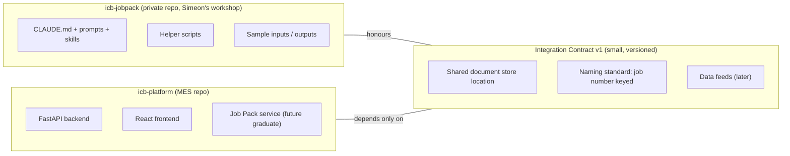

---

## 6. Phase 5 — Future Development Model

Two workflows will coexist. This is deliberate: they serve different kinds of change.

### 6.1 Workflow A — Simeon's fast loop (daily, unchanged in spirit)

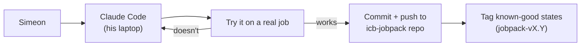

What changes for Simeon: **one habit** — push to GitHub at the end of a session. Claude Code can do the commit and push for him when he asks; it becomes part of the conversation ("save today's work").

### 6.2 Workflow B — Graduation loop (occasional, per stable feature)

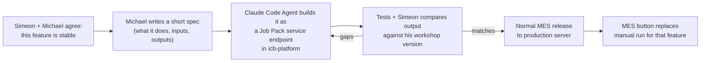

### 6.3 Workflow C — Contract change (rare)

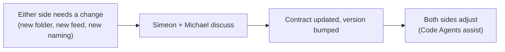

**Division of labour, in one line each:**

- **Simeon:** owns pack correctness, invents improvements, pushes his repo, flags features ready to graduate.
- **Michael (BA):** owns the contract, writes graduation specs, prioritises the roadmap.
- **Claude Code Agents:** package/repo setup, discovery on the code, building graduated services, tests, MES UI links.
- **MES team process:** normal releases for anything that lands in `icb-platform`.

---

## 7. Phase 6 — Recommended (To-Be) Architecture

### 7.1 System architecture

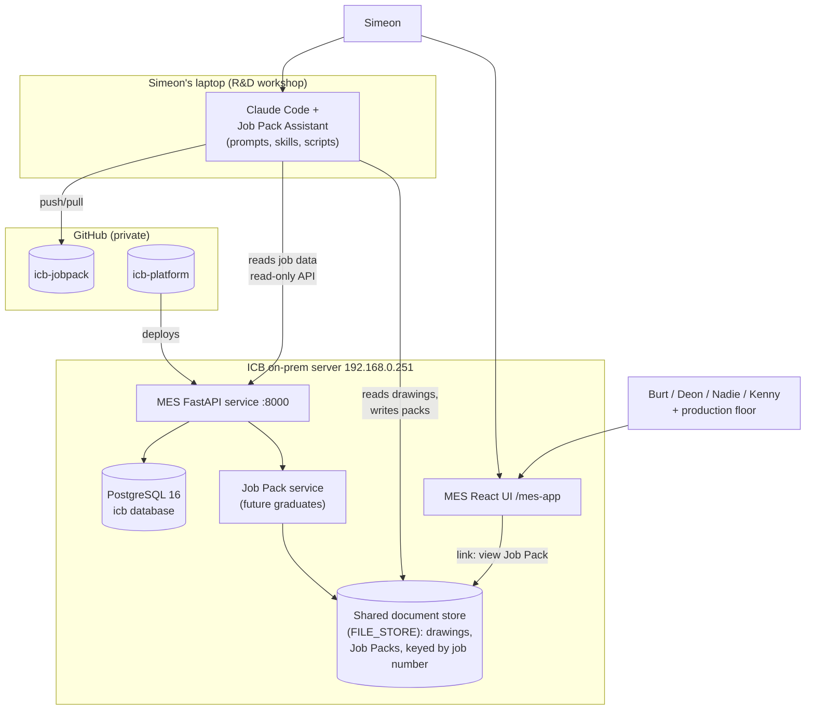

### 7.2 Data flow (To-Be, Stage: first integration)

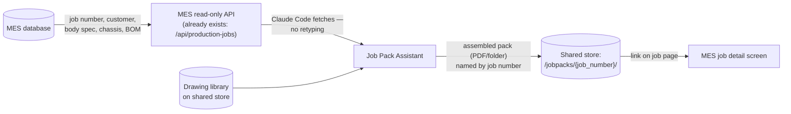

### 7.3 Document flow

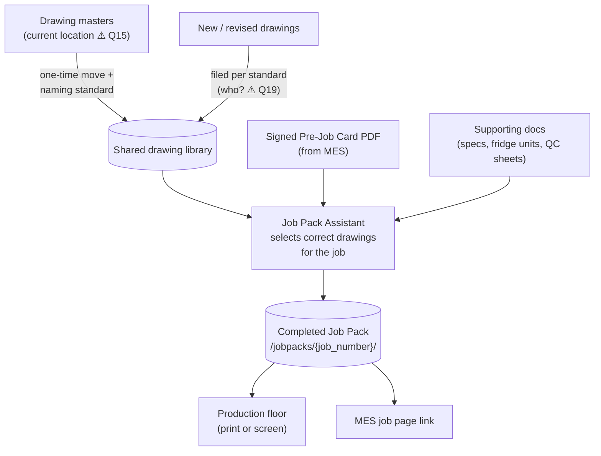

### 7.4 AI interaction

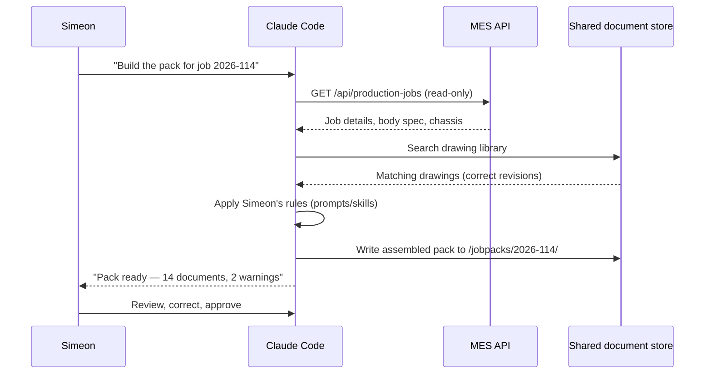

### 7.5 To-Be user workflow (swim-lanes)

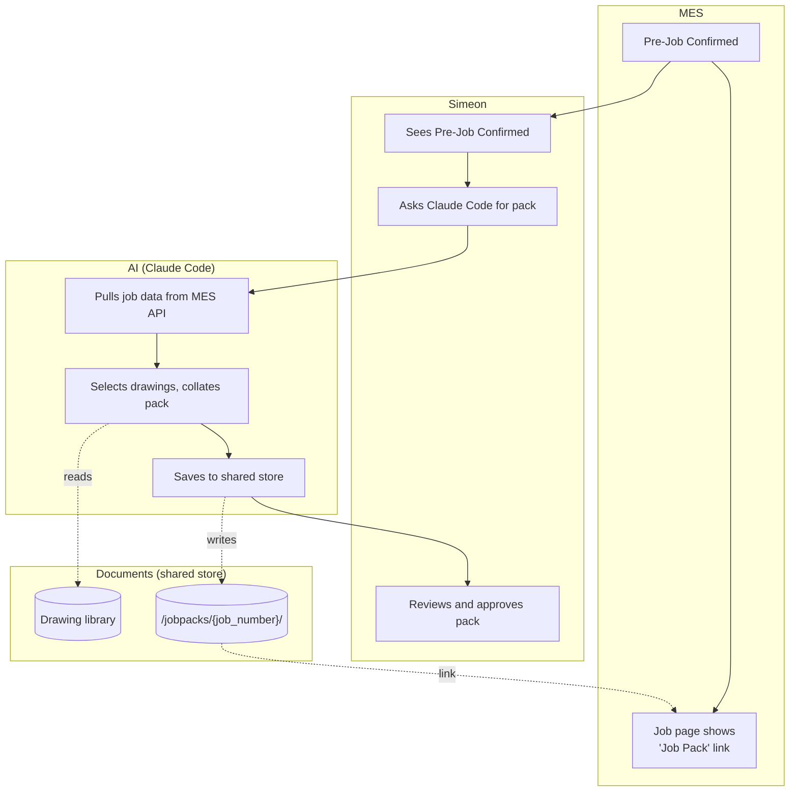

### 7.6 Deployment (high level)

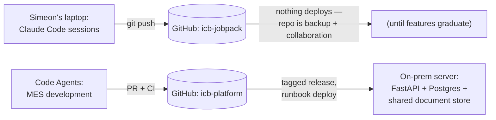

Note the asymmetry — it is intentional. `icb-jobpack` deploys nowhere; it is a safety net and collaboration point. Only graduated features enter the deployment pipeline, via the MES repo.

---

## 8. Phase 7 — Risks and Mitigations

| # | Risk | Likelihood | Impact | Mitigation | Addressed by |
|---|---|---|---|---|---|
| R1 | **Single point of failure** — laptop lost/broken, capability gone | Medium | Critical | Private GitHub repo + shared document store; packs reproducible from repo | Roadmap Phase 0 |
| R2 | **Knowledge loss** — Simeon unavailable; nobody else can produce packs | Medium | Critical | Prompts versioned in Git; Discovery documents the workflow; graduated features run without him | Phases 0–2, 4 |
| R3 | **Local-only development** — improvements never leave the laptop | High today | High | The one-habit change: push at end of session; Michael monitors repo activity | Phase 0 |
| R4 | **Version conflicts** — pack built with old job data, or old prompt logic | Medium | Medium | Job data pulled live from MES API (no retyping); known-good tags; contract versioning | Phases 3–4 |
| R5 | **Document consistency** — two copies of drawings drift apart | High | High | One shared drawing library as single source of truth; naming standard; laptop copies become caches, never masters | Phase 2 |
| R6 | **AI prompt management** — prompts are business logic but invisible/unversioned | High today | High | Prompts live in the repo; changes visible in Git history; known-good tags allow rollback | Phase 0 |
| R7 | **Security** — customer/job data flowing through AI tooling; API keys on a laptop | Medium | Medium | Private repos; `.gitignore` secrets from day one; Anthropic keys via env not files; read-only MES API account for the assistant; ICB network/VPN only | Phases 0, 3 |
| R8 | **Future maintainability** — workshop grows into an unmaintainable tangle | Medium | Medium | Graduation discipline: anything business-critical gets rebuilt clean by Code Agents with tests; workshop stays experimental by definition | Phase 4 |
| R9 | **Integration drag** — contract becomes heavyweight and slows Simeon | Low | Medium | Contract deliberately tiny (location + naming + feeds); Michael guards its size | Governance §2.6 |
| R10 | **MES over-dependence too early** — MES relies on packs before process is stable | Low | Medium | MES shows links/status only (informational) until a feature graduates with tests | Phases 3–4 |

---

## 9. Phase 8 — Implementation Roadmap

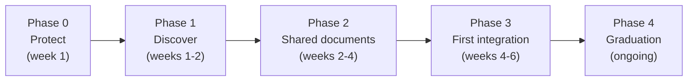

### Phase 0 — Protect (this week)

| | |
|---|---|
| Objectives | Remove the laptop single-point-of-failure |
| Deliverables | Packaged copy of the project (see packaging instructions); private `icb-jobpack` repo with the code/prompts pushed; secrets excluded; Michael as second admin |
| Business value | Insurance for an existing business capability — highest value-to-effort step in this whole plan |
| Dependencies | Simeon's 30–60 minutes; GitHub organisation access |
| Complexity | **Low** |
| Code Agent involvement | Low — help Simeon package, create repo, write `.gitignore`, first push |

### Phase 1 — Discover (weeks 1–2)

| | |
|---|---|
| Objectives | Replace the assumptions in this report with facts |
| Deliverables | Completed questionnaire; Code Agent inventory of the repo (what exists, what it does, plain-English summary); updated As-Is workflow; v1.0 of this report |
| Business value | Informed decisions; captured tribal knowledge |
| Dependencies | Phase 0; Simeon interview (~1 hour) |
| Complexity | **Low–Medium** |
| Code Agent involvement | Medium — read the packaged code and produce the inventory |

### Phase 2 — Shared document standard (weeks 2–4)

| | |
|---|---|
| Objectives | One agreed home for drawings and packs; naming standard keyed on job number |
| Deliverables | Integration Contract v1; drawing library on the ICB server/share; migration of masters; Simeon's tool re-pointed at the shared store |
| Business value | Ends document drift (R5); makes packs findable by anyone; prerequisite for everything after |
| Dependencies | Phase 1 (need to know current locations/formats — Q15–Q21); server storage decision with Marnus |
| Complexity | **Medium** (mostly agreement, some file moving) |
| Code Agent involvement | Medium — folder structure, migration scripts, updating Simeon's prompts/scripts to new paths |

### Phase 3 — First integration: links and data (weeks 4–6)

| | |
|---|---|
| Objectives | Stop retyping job data; make packs visible from the MES |
| Deliverables | Job Pack Assistant reads job details from existing MES read-only APIs (`/api/production-jobs`); MES job detail page shows a "Job Pack" link (and simple ready/not-ready status); read-only MES account for the assistant |
| Business value | Fewer transcription errors; production floor and office see pack status without asking Simeon |
| Dependencies | Phase 2; small MES change (one link/status field) |
| Complexity | **Medium** |
| Code Agent involvement | High — MES UI/API work is theirs; plus wiring the assistant's data fetch |

### Phase 4 — Graduation (ongoing, feature by feature)

| | |
|---|---|
| Objectives | Turn stable, repeatable functions into MES-callable services with tests |
| Deliverables | Per feature: short spec → Job Pack service endpoint in `icb-platform` → side-by-side output comparison with Simeon's version → MES button |
| Business value | Pack assembly works even without Simeon at the keyboard; scales to more jobs/branches; quality locked in by tests |
| Dependencies | Phase 3; per-feature stability agreement (Simeon + Michael) |
| Complexity | **Medium–High per feature** |
| Code Agent involvement | Very high — they build, test and maintain each graduated service |

---

## 10. Final Recommendation

**Adopt Option 5/6 — the Hybrid with Graduation Model — delivered through the five-phase roadmap above.**

Scored against the brief's seven criteria:

| Criterion | How this approach delivers |
|---|---|
| Simplicity | Each step is small; the only new concept is a one-page contract |
| Maintainability | Fast-changing things stay in the workshop; slow-changing things get tests and releases; nothing is coupled that shouldn't be |
| Scalability | Graduated services scale beyond one person; the workshop keeps feeding them |
| Ease of use | Simeon's daily experience is unchanged plus one push habit; other users get MES buttons/links, no new tools |
| Long-term business value | Tribal knowledge captured in Git; capability survives people and laptops; MES becomes the single pane of glass |
| Supportability by Code Agents | Clean seam, small specs, two well-defined repos — ideal Code Agent work packages |
| Simeon stays SME, MES not slowed | The core design goal: his repo is his workshop, the MES depends only on the contract |

**Trade-offs accepted, stated plainly:**

1. **Two repositories** instead of one — mild admin overhead, in exchange for decoupled speed.
2. **The MES's view of packs is shallow at first** (a link and a status, not deep data) — in exchange for not rebuilding a moving target.
3. **Graduation takes discipline** — someone (Michael) must keep judging what is stable enough to graduate; skipping this judgement is how workshops become unmaintainable production systems.
4. **Some duplication during transition** — while a feature graduates, Simeon's version and the service version briefly coexist; the side-by-side comparison is the safety mechanism, then the manual version retires.

**What we explicitly rejected and why:** merging into the MES (kills Simeon's speed, contradicts the brief), an immediate API conversion (nothing callable exists — fact F3), submodules (complexity without benefit for a business-user team), and doing nothing (the laptop is the risk).

---

## 11. Phase 9 — Open Questions Register

No question below has been silently assumed. Where the report needed a working assumption, it is marked ⚠ in the text and traced here.

| # | Question | Why it matters | Ask | Blocks |
|---|---|---|---|---|
| Q1 | What exactly does a finished ICB Job Pack contain (document list)? | Defines scope, contract content, and graduation specs | Simeon | Phase 2 |
| Q2 | Who consumes the packs — floor supervisors, QC, stores? Printed or on-screen? | Determines output format and MES link design | Simeon | Phase 3 |
| Q3 | How often is a pack produced, and how long does it take with/without the assistant? | Quantifies business value; prioritises graduation order | Simeon | Phase 1 |
| Q4 | At what exact point in the MES workflow is a pack needed (Pre-Job Confirmed? Scheduled? Chassis received?) | Placement of the MES link/status and any future trigger | Simeon + Deon | Phase 3 |
| Q5 | What goes wrong when a pack is wrong (rework, wrong drawings on floor)? Any examples? | Business case evidence; QC checks to build into graduated services | Simeon | Phase 1 |
| Q6 | Does it extract data from drawings/PDFs (dimensions, part numbers)? | A distinct capability with its own graduation path | Simeon | Phase 1 |
| Q7 | Does it answer plain-English questions over documents? | Ditto | Simeon | Phase 1 |
| Q8 | Does it generate new documents (cover sheets, checklists)? | Ditto | Simeon | Phase 1 |
| Q9 | How are drawing revisions handled — how does it know which revision is current? | The highest-risk quality question in the whole process | Simeon | Phase 2 |
| Q10 | What is in the project folder — scripts, and in what language? | Sizing Code Agent discovery work | Packaged copy | Phase 1 |
| Q11 | Any local database or index, or plain folders? | Migration complexity to shared store | Packaged copy | Phase 2 |
| Q12 | Where do the prompts/instructions live (`CLAUDE.md`, skills, other)? | The core IP to version and protect | Packaged copy | Phase 0 |
| Q13 | Is every pack a fresh conversation, or are there saved commands/skills he re-runs? | Distinguishes repeatable (graduatable) parts from judgement parts | Simeon | Phase 4 |
| Q14 | Which Claude Code plan/account is used? Any MCPs/extensions installed? | Licensing, security, reproducibility on a second machine | Simeon | Phase 0 |
| Q15 | Where do drawing masters live today (laptop, shared drive, both)? | Single-source-of-truth design | Simeon | Phase 2 |
| Q16 | File formats in play (PDF, DWG, XLSX, images)? | Storage and viewer decisions; MES link behaviour | Simeon | Phase 2 |
| Q17 | Current naming convention for drawings and packs, if any? | Contract naming standard starts from current practice | Simeon | Phase 2 |
| Q18 | Where do finished packs go today, and are old packs kept? | History/audit requirements for the shared store | Simeon | Phase 2 |
| Q19 | Who files new/revised drawings, and how do they reach Simeon today? | Upstream process for the drawing library | Simeon + engineering | Phase 2 |
| Q20 | Are any documents customer-confidential with access restrictions? | Shared-store permissions design | Simeon + Michael | Phase 2 |
| Q21 | Rough volume: how many drawings/documents in the library today? | Storage sizing; migration effort | Simeon | Phase 2 |
| Q22 | Does ICB have a GitHub organisation, and who administers it? | Phase 0 mechanics | Michael | Phase 0 |
| Q23 | Server storage available for the shared document store (Marnus)? | Phase 2 infrastructure | Marnus | Phase 2 |

**Process from here (per the brief):** these questions go to Simeon via the companion questionnaire. Discovery pauses on the blocked items until answers arrive; Phase 0 (Protect) needs only Q12/Q14/Q22 and should not wait for the rest.

